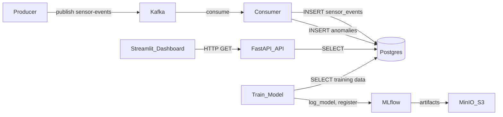

# AI_pipeline (IoT Anomaly Detection)

An end-to-end IoT anomaly detection pipeline:

**Producer → Kafka → Consumer (IsolationForest scoring) → Postgres → FastAPI API → Streamlit Dashboard**  
with **MLflow + MinIO** for model registry/artifacts.

---

## What this repo contains

### Components (services)
- **Producer** (`producer/sensor_simulator.py`): generates synthetic sensor telemetry and publishes JSON events to Kafka topic `sensor-events`.
- **Consumer** (`consumer/consumer.py`): consumes Kafka events, stores raw events in Postgres, scores anomalies using an Isolation Forest model, stores anomaly results, and optionally sends Slack alerts.
- **API** (`api/main.py`): FastAPI service that exposes read endpoints for recent events/anomalies and a time-window anomaly query endpoint.
- **Dashboard** (`dashboard/app.py`): Streamlit UI that calls the API to display events/anomalies and plot anomaly trends.
- **Training** (`ml/train_model.py`): trains an Isolation Forest from Postgres data, logs model to MLflow, and stores a local `.joblib` model file.

### Infrastructure (containers)
Defined in `infra/docker-compose.yaml`:
- **Kafka + Zookeeper**: streaming backbone for sensor events.
- **Postgres**: primary storage for events/anomalies and model registry metadata.
- **MLflow server**: experiment tracking + model registry.
- **MinIO (S3-compatible)**: artifact store for MLflow models.
- **PgAdmin**: optional DB UI.

---

## Architecture & data flow



### Event schema (Kafka message)
The producer publishes JSON like:
- `event_id` (uuid)
- `sensor_id` (e.g., `sensor_1`)
- `timestamp` (ISO-8601 UTC string)
- `temperature`, `pressure`, `vibration` (numeric)
- optional `anomaly_injected`, `anomaly_type` (only for simulator realism)

### Storage schema (Postgres)
Created by SQL migrations in `migrations/*.sql` (applied by the API on startup):
- `sensor_events`: raw events + normalized columns
- `anomalies`: anomaly records (score, model name, created_at)
- `model_registry`: model metadata for trained model versions

---

## Technologies used (and how they’re used)

### Core stack
- **Python**: application language for all services.
- **Kafka (Confluent images)**: event streaming; topic is `sensor-events`.
- **Postgres 15**: persistent store; consumer writes, API/ML reads.
- **FastAPI + Uvicorn**: REST API for querying stored events/anomalies.
- **Streamlit**: dashboard UI consuming API endpoints.
- **scikit-learn (IsolationForest)**: anomaly detection model.
- **MLflow**: experiment tracking + model registry; consumer can load models from MLflow when enabled.
- **MinIO**: S3-compatible storage for MLflow artifacts.

### Operational concerns built-in
- **Centralized settings**: `shared/settings.py` loads config from repo-root `.env` + environment variables.
- **Structured logs**: JSON logs via `shared/logging.py`.
- **Retry/backoff**: `shared/retry.py` wraps critical connections (Kafka/Postgres init).
- **Migrations**: lightweight SQL migrations via `shared/migrations.py` (idempotent).

---

## Running the system

### Option A: All-in-Docker (recommended)
From repo root:

```bash
docker compose -f infra/docker-compose.yaml up --build
```

Endpoints:
- **API**: `http://localhost:8000/health`
- **Dashboard**: `http://localhost:8501`
- **MLflow**: `http://localhost:5001`
- **PgAdmin**: `http://localhost:5050`

### Option B: Infra in Docker, apps local (common for development)
1) Start infra:

```bash
docker compose -f infra/docker-compose.yaml up -d kafka zookeeper postgres mlflow minio pgadmin
```

2) Run apps locally from repo root (use your venv python):

```bash
# Producer (Kafka -> localhost:29092)
./.venv/bin/python -m producer.sensor_simulator

# Consumer (Kafka -> localhost:29092, Postgres -> localhost:5433)
./.venv/bin/python -m consumer.consumer

# API (Postgres -> localhost:5433)
./.venv/bin/uvicorn api.main:app --reload --port 8000

# Dashboard (calls API on localhost:8000)
./.venv/bin/streamlit run dashboard/app.py --server.port=8501
```

Important:
- Run **only one consumer per `KAFKA_GROUP_ID`** for the single-partition topic, otherwise one instance will get `Updated partition assignment: []`.

---

## Configuration (.env)

Create a `.env` in the **repo root** (see `env.example`).

### Common
- `LOG_LEVEL=INFO`
- `API_KEY=` (optional; if set, clients must send `X-API-Key`)

### Kafka
- `KAFKA_BOOTSTRAP_SERVERS=localhost:29092` (local apps talking to Dockerized Kafka)
- `KAFKA_TOPIC=sensor-events`
- `KAFKA_GROUP_ID=anomaly-detection-consumer`
- `KAFKA_ADVERTISED_HOST=localhost` (used by Compose for Kafka advertised listeners)

### Postgres (local apps)
- `PG_HOST=localhost`
- `PG_PORT=5433` (host-mapped port)
- `PG_DB=iot_pipeline`
- `PG_USER=admin`
- `PG_PASSWORD=admin`

### MLflow model loading in consumer (optional)
To load the model from MLflow instead of local `ml/models/isolation_forest.joblib`:
- `USE_MLFLOW_MODEL=true`
- `MLFLOW_TRACKING_URI=http://127.0.0.1:5001`
- `MLFLOW_MODEL_URI=models:/isolation_forest/1` (or a stage like `Production`)

If MLflow is using MinIO/S3 artifact storage:
- `MLFLOW_S3_ENDPOINT_URL=http://127.0.0.1:9100`
- `AWS_ACCESS_KEY_ID=minio`
- `AWS_SECRET_ACCESS_KEY=minio12345`
- `AWS_DEFAULT_REGION=us-east-1`

### Slack alerts (optional)
- `SLACK_WEBHOOK_URL=...`
- `ALERT_COOLDOWN_SECONDS=1`

---

## API endpoints

All endpoints require `X-API-Key` header only if `API_KEY` is set.
- `GET /health`
- `GET /events/latest?sensor_id=<optional>&limit=<n>&offset=<n>`
- `GET /anomalies/latest?sensor_id=<optional>&limit=<n>&offset=<n>`
- `GET /anomalies?sensor_id=<optional>&start_time=<iso>&end_time=<iso>&limit=<n>&offset=<n>`

---

## Model lifecycle

- Training script `ml/train_model.py`:
  - pulls features (`temperature`, `pressure`, `vibration`) from `sensor_events`
  - trains `IsolationForest`
  - logs and registers to MLflow (`registered_model_name=isolation_forest`)
  - saves local artifact under `models/` as `.joblib`
- Consumer `consumer/consumer.py`:
  - default: loads local model `ml/models/isolation_forest.joblib`
  - optional: loads from MLflow if `USE_MLFLOW_MODEL=true`

---

## Repository layout
- `api/`: FastAPI app + DB pool + schemas
- `consumer/`: Kafka consumer, scoring, DB writes, Slack alerts
- `producer/`: Kafka producer simulator
- `dashboard/`: Streamlit UI
- `ml/`: training code + shipped baseline model under `ml/models/`
- `shared/`: shared settings/logging/retry/migrations utilities
- `infra/`: docker-compose + mlflow Dockerfile
- `migrations/`: SQL schema migrations
- `tests/`: small regression tests

---

## Troubleshooting

- **Consumer shows `Updated partition assignment: []`**:
  - You have another consumer running with the same `KAFKA_GROUP_ID`. Stop one, or set a different group id.
- **Consumer can’t connect to Postgres (`could not translate host name \"postgres\"`)**:
  - You’re running locally but `PG_HOST=postgres`. Set `PG_HOST=localhost` and `PG_PORT=5433`.
- **Dashboard error `No module named 'shared'` when running locally**:
  - Run from repo root, or use the provided commands (Streamlit runs `dashboard/app.py` with a sys.path bootstrap).
